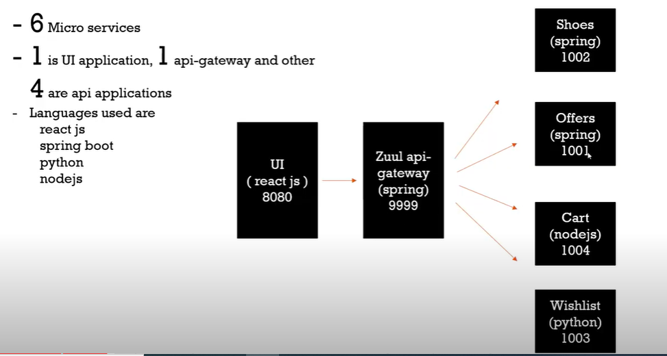

## Micro services on docker | deploying micro services on docker

**Into to application that we deploy**




Dockerizing ReactJS application
```docker
FROM node:8
WORKDIR /app
COPY . .
RUN npm install
EXPOSE 8080
CMD ["npm","start"]
```

Dockerizing Spring Boot application
```docker
FROM maven as build
WORKDIR /app
COPY . .
RUN mvn install

FROM openjdk:11.0.10-jre 
WORKDIR /app
COPY --from=build /app/target/zuul-0.0.1-SNAPSHOT.jar /app
EXPOSE 9999
CMD ["java","-jar","zuul-0.0.1-SNAPSHOT.jar"]
```

Dockerizing NodeJS application
```docker
FROM node:14
WORKDIR /app
COPY . .
RUN npm install
EXPOSE 1004
CMD ["node","index.js"]
```

Dockerizing Python application
```docker
FROM python:3
COPY . .
RUN pip install flask flask_cors
EXPOSE 1003
CMD ["python","index.py"]
```

Deploying the micro service application on Docker host
```bash
cd ui-web-app-reactjs
docker build . -t ui

cd zuul-api-gateway
docker build . -t zuul-api

cd shoes-microservice-spring-boot
docker build . -t shoes

cd offers-microservice-spring-boot
docker build . -t offers

cd cart-microservice-nodejs
docker build . -t cart

cd wishlist-microservice-python
docker build . -t wish

docker images

docker run -d -p 8080:8080 ui

docker run -d -p 9999:9999 zuul-api

docker run -d -p 1002:1002 shoes

docker run -d -p 1001:1001 offers

docker run -d -p 1004:1004 cart

docker run -d -p 1003:1003 wish
```